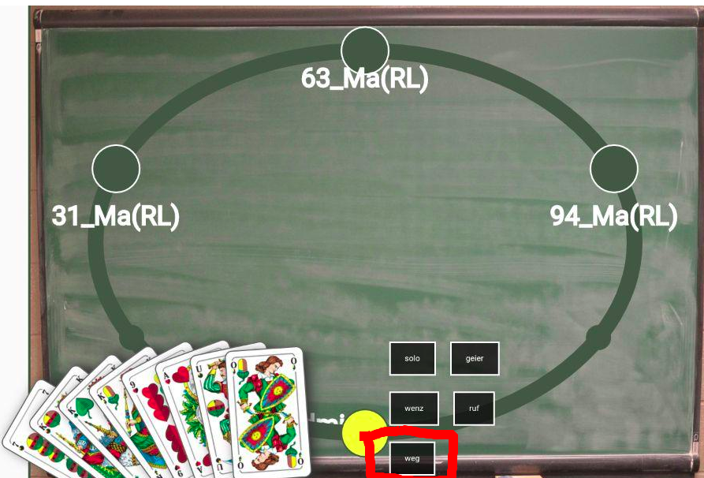
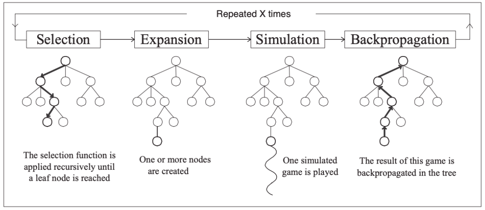
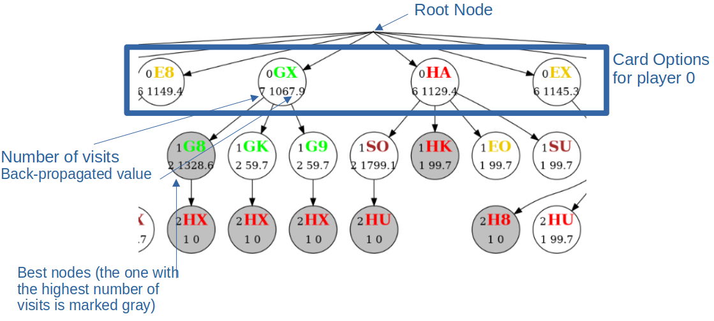
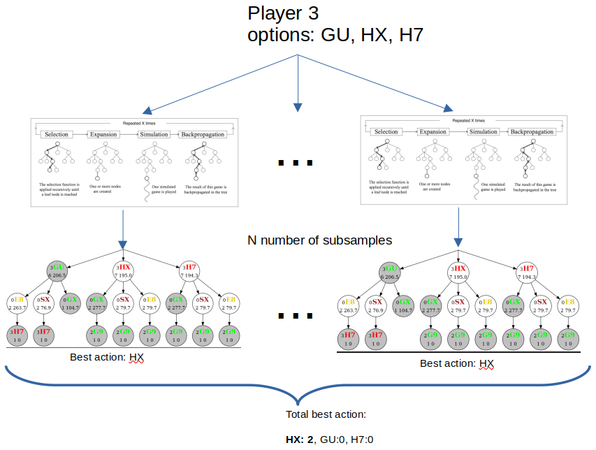
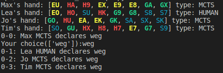
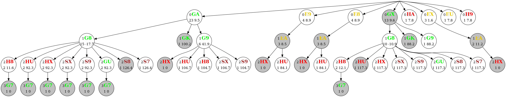
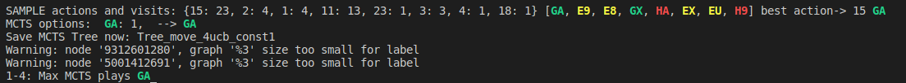
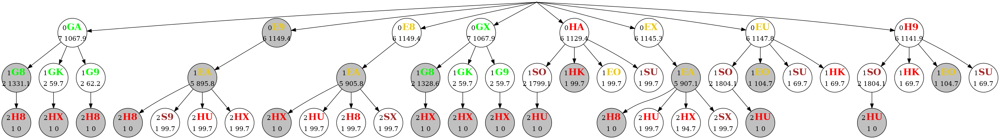
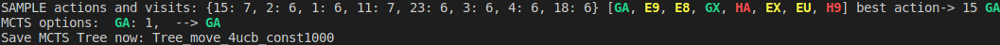
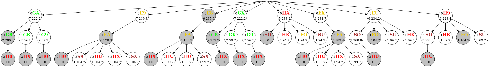

# Sheepshead Rules
In this tutorial we use a certain variant of the bavarian card game sheeps head(Schafkopf) to
learn and understand **basic machine learning/reinforcement learning techniques**.
Here is a quick overview of the rules.
There are 4 player having each 8 cards.


The game consists of 2 phases:
1. Declaration Phase
    * for simplicity **only weg/weiter** is allowed for each player
    * this means it is alwayse played **RAMSCH**
    * In this RAMSCH variant hearts is trump!
    * each player plays on his own.
2. Playing Phase
    * ech player plays a card after each other
    * afer a round the highest card is evaulated
    * the player with the highest card gets the trick(all 4 cards)
    * if all cards are played you count the points in your tricks
    * normally you aim to have no tricks at all!
    * for more details see [here](https://www.youtube.com/watch?v=ZLRpImBF-Wc)
3. Money Phase : **Ramsch**
    * Case 1 DURCHMARSCH: if one player has >90 points
        * the one with >90 points wins 45 cents
        * all others loose 15 cents
    * Case 2 NORMAL GAME: nobody has >90 points
        * if you have 0 points you get 15cents
        * if you have <30 points you get 10cents
        * if you have >30 points and you did not loose you get 5cents
        * the looser gets all minus cents what other players earned
# Monte Carlo Tree Search
A Monte Carlo Tree Search algorithm consists of the following 4 steps


An example for Schafkopf would be:


if you want to save the mcts trees use option "save_tree": 1

Subsampling:

* Unfortunately Sheepshead is an imperfect information game.
* This means we do not know the cards of the other players.
* That is why we can estimate (subsample) the cards of our enemys.
* This means we can take a best guess (based on the cards that were played already)


## Monte Carlo Tree Search Player
Player type: "MCTS_OFF_10_50"
* OFF: 
    - OFF means no subsampling: it is assumed that the MCTS Player knows all other cards
    - if you put a number here e.g. MCTS_20_10_50 --> the other player cards are subsampled 20 times and for each subsample the best card is evaluated
* 10: 
    - number of playouts (the higher the better)
    - if this number is higher the tree is more deep
* 50: ucb constant
    - if you choose **1** --> **exploitation**
    - if you choose **1000** --> **exploration**
## Exploration vs Exploitation
Let's take this example:



* Player 1 has ucb_const = 1: MCTS_20_50_**1**:



* If Player has ucb_const = 1000: MCTS_20_50_**1000**: 



* You can see that the tree for ucb=1 is more deep and the apprently best option GA is exploited more!
* The GA has 23 visits and many other options as e.g. HA, H9, EU is only visited once
* For ucb=1000 you can see that the tree is not so deep but more spread out.
* The GA has 7 visits which is only one more compared to all other nodes

* You should find a good **balance** between exploraion and exploitation that is why I advise to use ucb_const=**200**:


## Proximal Policy Optimization
will soon come

## Transformers Network
will come in the future

# Example Game
```
Max's hand: [EO, GO, EU, GU, HU, EA, E9, SA] type: RANDOM
Lea's hand: [HO, H9, EK, GA, GX, GK, SX, S8] type: RANDOM
Jo's hand: [SU, HA, H8, H7, EX, G9, G7, S7] type: RANDOM
Tim's hand: [SO, HX, HK, E8, E7, G8, SK, S9] type: RANDOM
0-0: Max RANDOM declares weg
0-1: Lea RANDOM declares weg
0-2: Jo RANDOM declares weg
0-3: Tim RANDOM declares weg

1-4: Max RANDOM plays E9
1-5: Lea RANDOM plays H9
1-6: Jo RANDOM plays EX
1-7: Tim RANDOM plays S9
        Winner: Lea with H9 --> 10

2-8: Lea RANDOM plays GX
2-9: Jo RANDOM plays HA
2-10: Tim RANDOM plays G8
2-11: Max RANDOM plays GU
        Winner: Max with GU --> 23

3-12: Max RANDOM plays HU
3-13: Lea RANDOM plays S8
3-14: Jo RANDOM plays H8
3-15: Tim RANDOM plays SK
        Winner: Max with HU --> 6

4-16: Max RANDOM plays EA
4-17: Lea RANDOM plays SX
4-18: Jo RANDOM plays G7
4-19: Tim RANDOM plays E8
        Winner: Max with EA --> 21

5-20: Max RANDOM plays GO
5-21: Lea RANDOM plays EK
5-22: Jo RANDOM plays SU
5-23: Tim RANDOM plays SO
        Winner: Max with GO --> 12

6-24: Max RANDOM plays SA
6-25: Lea RANDOM plays HO
6-26: Jo RANDOM plays S7
6-27: Tim RANDOM plays E7
        Winner: Lea with HO --> 14

7-28: Lea RANDOM plays GK
7-29: Jo RANDOM plays G9
7-30: Tim RANDOM plays HX
7-31: Max RANDOM plays EO
        Winner: Max with EO --> 17

8-32: Max RANDOM plays EU
8-33: Lea RANDOM plays GA
8-34: Jo RANDOM plays H7
8-35: Tim RANDOM plays HK
        Winner: Max with EU --> 17

Max's hand: [] offhand: [[GU, GX, HA, G8], [HU, S8, H8, SK], [EA, SX, G7, E8], [GO, EK, SU, SO], [EO, GK, G9, HX], [EU, GA, H7, HK]] points: 96 --> 45$
Lea's hand: [] offhand: [[E9, H9, EX, S9], [SA, HO, S7, E7]] points: 24 --> -15$
Jo's hand: [] offhand: [] points: 0 --> -15$
Tim's hand: [] offhand: [] points: 0 --> -15$
```